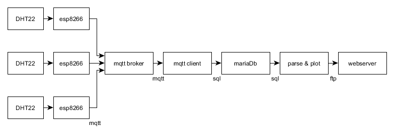

# My Home IoT

The goal of this project was to be able to monitor and store humidity and temperature readings from multiple spots within my home WiFi area. Eventually I will use the gathered information to automatically open windows and regulate heaters and stuff.



The project supports a high number of DHT22 sensors without altering the code (If you find out the limiting factor for the max number of sensors let me know). Each sensor is hooked up to a ESP8266 which sends the sensor readings via WiFi to the MQTT broker. A machine in the network runs a MQTT Client and parses the sensor readings into a SQL database. A HTML plot file gets generated at a predefined frequency (default: 30 minutes) and uploaded to a web server. 

## What do you need?

The budget for this project was 34.28  Euros. With that I bought:
 * Three DHT22 sensors
 * Five AZDelivery ESP8266 Wifi Boards and USB programmers. 

 With that I built three WiFi temperature and humidity sensors. The remaining two ESP8266s will one day be used for switching stuff. ESP32s do the trick as well but the ESP8266 is cheaper. In Addition you need
 * WiFi
 * A machine that runs Python 3 (I used my Synology DS218j)
 * Some USB power supplies
 * Ideally a web server

## Sensor setup

There is lot's of [tutorials](https://randomnerdtutorials.com/esp8266-dht11dht22-temperature-and-humidity-web-server-with-arduino-ide/) on how to connect a DHT22 to a serial input. Just don't forget the 4.7k Ohm resistor and you'll be fine. I crammed the USB programmer and the ESP Board into a little plastic box and glued the sensor to the top of it. 

## Micropython Setup

The virgin ESP boards don't run Micropython. You need to flash the [Micropython firmware.](https://docs.micropython.org/en/latest/esp8266/tutorial/intro.html) Now the USB Programmer lets you access the ESP Chip via virtual COM Port. You can access the Python Shell and the chip's file system. If you're a VSCode user like me check out [Pymakr](!https://marketplace.visualstudio.com/items?itemName=pycom.Pymakr). It's a nice little Micropython development tool. Here's what my *pymakr.conf* looks like  

```json

{
    "address": "COM7",
    "username": "micro",
    "password": "python",
    "sync_folder": "/esp8266/scripts",
    "open_on_start": true,
    "safe_boot_on_upload": false,
    "py_ignore": [
        "pymakr.conf",
        ".vscode",
        ".gitignore",
        ".git",
        "project.pymakr",
        "env",
        "venv"
    ],
    "fast_upload": false
}
```

Make sure you use the right virtual COM Port. With that you should be able to upload the scripts in */esp8266/scripts* to the chip. Next you need to install some libraries using [micro-pip (upip)](https://docs.micropython.org/en/latest/reference/packages.html). In the Micropython shell run:

```terminal
upip.install('micropython-umqtt.simple')
```
and 
```terminal
upip.install('micropython-ffilib')
```

## Synology specific
https://www.paaalm07.at/synology/install-configure-the-mosquitto-mqtt-broker/


## Contributing
Pull requests are welcome. For major changes, please open an issue first to discuss what you would like to change.

Please make sure to update tests as appropriate.

## License
[MIT](https://choosealicense.com/licenses/mit/)


